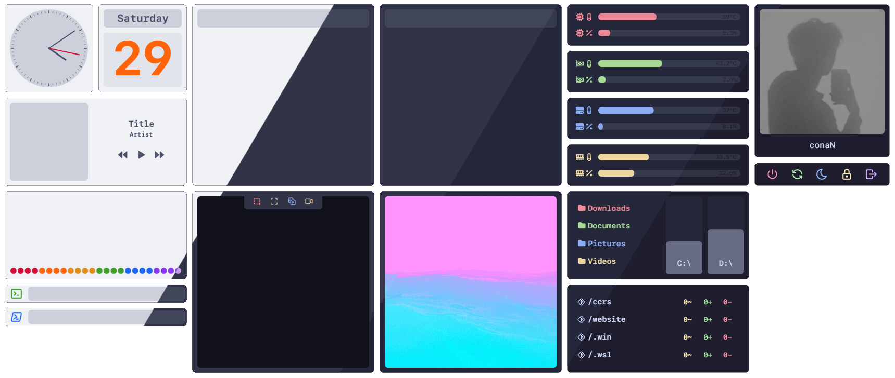
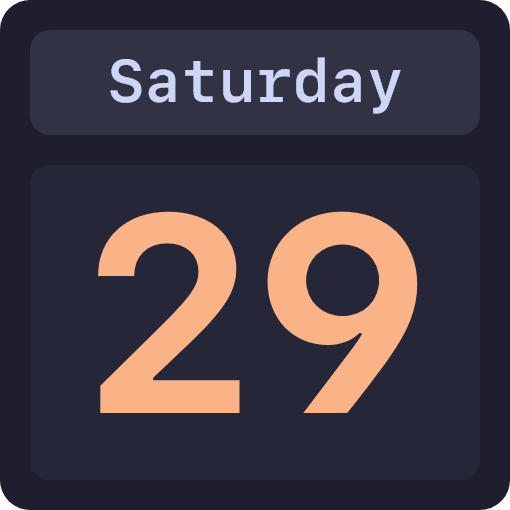

<div align="center">
  
  <h3 align="center"><strong>CCRS</strong></h3>
</div>
<br>

<br>

## 🧩 Widgets
<details>
  <summary><strong>Media Player</strong></summary>

  A simple Media Player. It uses the native Windows API which means it will automatically detect the current song and no extra configuration is required.<br><br>
  
  

</details>
<details>
  <summary><strong>Visualizer</strong></summary>

  An Audio Visualizer that automatically visualizes all playing audio. No extra configuration is required.<br><br>
  
  

</details>
<details>
  <summary><strong>CMD and PWSH</strong></summary>

  Convenient widgets that allow you to run any command in the respective shell. Useful for quick commands such as `wsl --shutdown` or `taskmgr`.<br><br>
  
  

</details>
<details>
  <summary><strong>Shutdown, Restart, Sign Out and Lock</strong></summary>

  Simple buttons that let you shutdown, restart, sign out or lock your computer. It only reacts on double-click and has a little confirmation popup to avoid accidentally triggering it.<br><br>
  
  
  
  

</details>
<details>
  <summary><strong>Gallery</strong></summary>

  A widget that displays the last image of a selected folder. This can be used for displaying the latest screenshot taken.<br><br>
  

</details>
<details>
  <summary><strong>Note</strong></summary>

  A place for you to write down to-dos or other things. Stored locally and persistent until you manually delete the content.<br><br>
  

</details>
<details>
  <summary><strong>Profile</strong></summary>

  Just a simple widget to display an image of your choice, such as your profile picture.<br><br>
  

</details>
<details>
  <summary><strong>Socials</strong></summary>

  Displays your GitHub and CodeBerg accounts and opens your profile on double-click. This can be useful if you share your rice somewhere.<br><br>
  

</details>
<details>
  <summary><strong>Clock</strong></summary>

  Just a clock, nothing special.<br><br>
  

</details>
<details>
  <summary><strong>Date</strong></summary>

  Just displays the current day, nothing special.<br><br>
  

</details>

## 🎨 Themes
<details>
  <summary><strong>Catppucin Latte</strong></summary>
  

</details>
<details>
  <summary><strong>Catppucin Frappe</strong></summary>
  

</details>
<details>
  <summary><strong>Catppucin Macchiato</strong></summary>
  

</details>
<details>
  <summary><strong>Catppucin Mocha</strong></summary>
  

</details>

## 📦 Installation
1. **Download and Install Rainmeter**  
   - Head over to the [official Rainmeter website](https://www.rainmeter.net/) and download the latest version.  
   - Follow the installer instructions and ensure Rainmeter is running after installation.

2. **Download the latest release**  
   - Go to the [Releases](https://github.com/336conaN/ccrs/releases) section of this repository.  
   - Download and run the latest `.rmskin` file.

## ⚒️ Configuration
All configuration and customization is handled through a single `settings.inc` file.  
When using the default Rainmeter skin location, the file is located at:
`%USERPROFILE%\Documents\Rainmeter\Skins\ccrs\@Resources\settings.inc`

Below is a breakdown of the available options:

```
This controls the overall size of the widgets. I recommend using 1 on a 1920x1080 monitor.  
Scale=1  

This sets the theme for all widgets. Available options are "catppuccin-latte", "catppuccin-frappe", "catppuccin-macchiato", and "catppuccin-mocha".  
Theme=catppuccin-mocha  

This is the image that'll be displayed in the Profile widget. Example: "C:\Users\RickAshley\Pictures\rickroll.png"  
ProfilePicture=#@#Assets\profile.png  

This is for the Gallery widget. It'll always display the latest image in the set folder.  
Gallery=C:\Users\conaN\Pictures\Screenshots  

This sets the used monospace font. "SFMono Nerd Font Mono" is included, but it can be any font as long as it's installed on the system.  
MonoFont=SFMono Nerd Font Mono  

This sets the font for regular text. "SF Pro" is included, but it can be any font as long as it's installed on the system.  
TextFont=SF Pro  

This controls the radius of the outer corners of all widgets. Set this to 8 to match the general Windows 11 aesthetic.  
CornerRadiusOutside=8  

This controls the corner radius of elements inside widgets, such as the visualizer bars.  
CornerRadiusInside=6  

This controls the border width around each widget.  
BorderWidthOutside=0  

This controls the border width of elements inside widgets, such as the song cover in the media player widget.  
BorderWidthInside=0  

This is for the Socials widget. The following username will be displayed, and it'll open the corresponding GitHub profile when double-clicking.  
GitHub=336conaN  

This is for the Socials widget. The following username will be displayed, and it'll open the corresponding CodeBerg profile when double-clicking.  
CodeBerg=336conaN
```

## 💡 Inspiration
While there are a lot of awesome skins out there, not a single one did what I was looking for.

- **Themes**  
  - There are usually only very limited theming options, such as light and dark mode. CCRS already has all Catppuccin flavors included, and it's incredibly easy to add other popular themes such as Nord or Tokyo Night.

- **Configuration**  
  - A lot of themes use Rainmeter to create a clunky and unresponsive UI for configuring the skins. In my opinion, the simpler, the better. CCRS just has a single text file you can open with any editor to easily change, import, or export your settings.

- **Compatibility**  
  - If you're like me and game a lot, many popular skins can cause problems because they rely on things like AHK, which often triggers anticheats. CCRS doesn't do any of that—it's just pure and simple Rainmeter.

- **Reliability**  
  - If you've used other skins featuring a media player, you probably know that it can be a pain to get it working with your media player or browser of choice. Often, you have to install additional plugins—and yeah, nobody wants that. CCRS just uses the native Windows API to get the song info. You don't need any extra plugins or configuration—it just works.

## ⭐ Contributing
Contributions are welcome! If you have an idea, bug fix, or feature request, feel free to:

1. **Open an issue** – Share your suggestion, report a bug, or request a new feature.  
2. **Submit a pull request (PR)** – If you've already implemented a fix or feature, open a PR, and I'll review it.

When contributing, please ensure your changes are clean, well-documented, and follow the existing structure of the project.  

Thanks for helping to improve CCRS!

