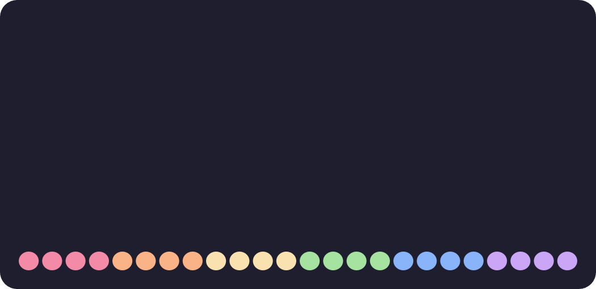

  
  <h3 align="center"><strong>CCRS</strong></h3>
  
conaN's cool rainmeter skins

## 🧩 Widgets

  
<strong>⭐ Media Player</strong>

  A simple Media Player. It uses the native Windows API which means it will automatically detect the current song and no extra configuration is required.  
  
  

  
<strong>⭐ Visualizer</strong>

  An Audio Visualizer that automatically visualizes all playing audio. No extra configuration is required.  
  
  

  
<strong>⭐ CMD and PWSH</strong>

  Convenient widgets that allow you to run any command in the respective shell. Useful for quick commands such as `wsl --shutdown` or `taskmgr`.  
  
  

  
<strong>⭐ Shutdown, Restart, Sign Out and Lock</strong>

  Simple buttons that let you shutdown, restart, sign out or lock your computer. It only reacts on double-click and has a little confirmation popup to avoid accidentally triggering it.  
  
  
  
  

  
<strong>⭐ Gallery</strong>

  A widget that displays the last image of a selected folder. This can be used for displaying the latest screenshot taken.  
  

  
<strong>⭐ Note</strong>

  A place for you to write down to-dos or other things. Stored locally and persistent until you manually delete the content.  
  

  
<strong>⭐ Profile</strong>

  Just a simple widget to display an image of your choice, such as your profile picture.  
  

  
<strong>⭐ Socials</strong>

  Displays your GitHub and CodeBerg accounts and opens your profile on double-click. This can be useful if you share your rice somewhere.  
  

  
<strong>⭐ Clock</strong>

  Just a clock, nothing special.  
  

  
<strong>⭐ Date</strong>

  Just displays the current day, nothing special.  
  

## 🎨 Themes

  
<strong>🌈 Catppucin Latte</strong>

  

  
<strong>🌈 Catppucin Frappe</strong>

  

  
<strong>🌈 Catppucin Macchiato</strong>

  

  
<strong>🌈 Catppucin Mocha</strong>

  

## 📦 Installation

## ⚒️ Customization

## 💡 Inspiration

## ⭐ Contributing

