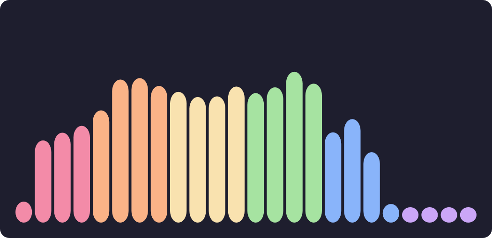
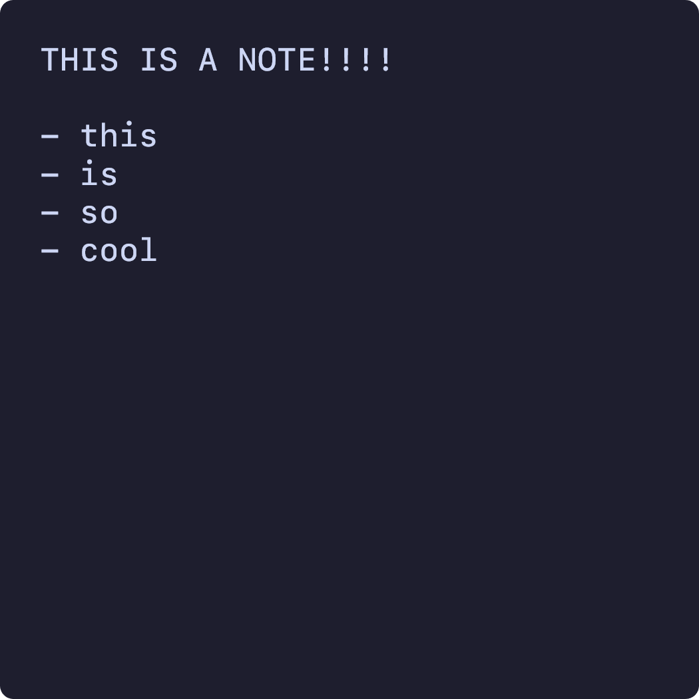
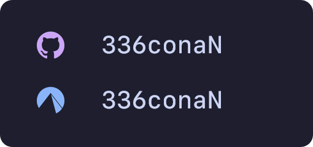
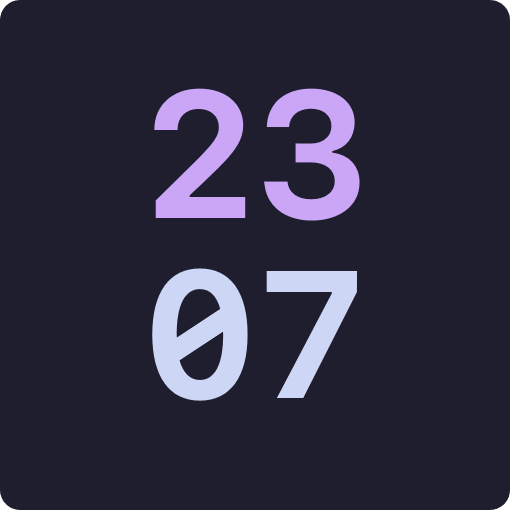
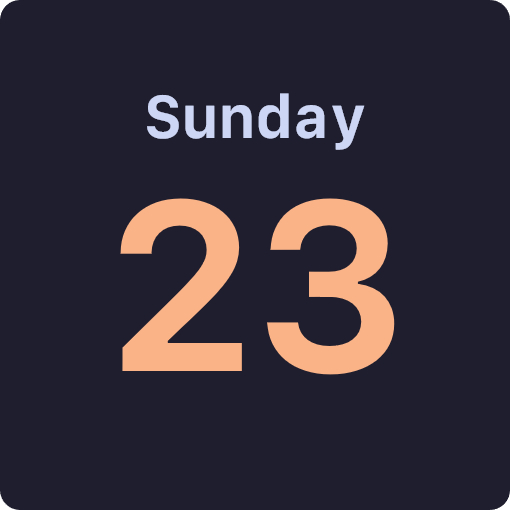

# 🧩 Widgets

At the moment, CCRS has a total of 14 widgets:

##### Media Player  
  

##### Visualizer  
  

##### cmd and pwsh  
  

##### Shutdown, Restart, Sign Out and Lock  
  
  
  

##### Gallery  

##### Notes  

##### Profile  

##### Socials  

##### Clock  

##### Date  

