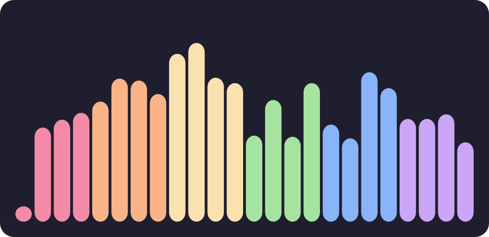
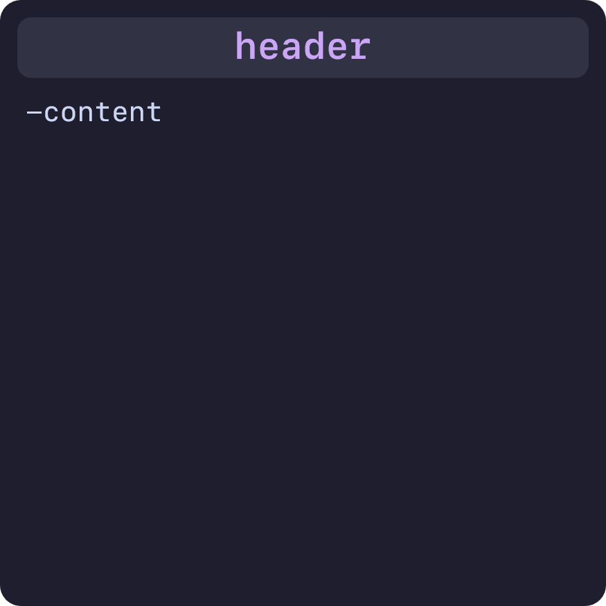

# 🧩 Widgets

**At the moment, CCRS has a total of 18 widgets**:
 

##### Media Player  
  

##### Visualizer  
  

##### Command Prompt and PowerShell  
  

##### Screenshots  

##### GIF Player  

##### Clock and Date  

##### Notes  
  

##### Hardware Monitor
  

  

##### Profile  

##### Menu  

##### Git  

##### Folder  

